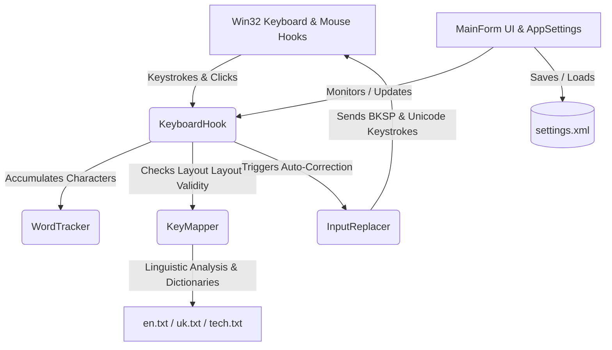

# System Specification: KeyboardLayoutSwitcher-Win11 (Baseline)

This document describes the existing functionality, architectural components, and heuristics of the KeyboardLayoutSwitcher-Win11 project. It serves as the primary system specification and source of truth for the codebase.

---

## 1. System Overview
**KeyboardLayoutSwitcher-Win11** is a lightweight, background utility for Windows 11 that automatically detects and corrects words mistakenly typed in the wrong keyboard layout (specifically between English and Ukrainian standard QWERTY/ЙЦУКЕН layouts). 

### Key Features:
- **Intellectual Layout Auto-Correction:** Automatically identifies layout mismatches based on frequency dictionaries and linguistic heuristics, switching the active layout and rewriting the mistyped word.
- **Windows 11 Native Integration:** Implements native Win11 Dark Mode UI and runs in the system tray.
- **Process Whitelisting / Blacklisting:** Allows limiting auto-correction functionality to specific applications (e.g., enable only in browsers or disable in code editors/games).
- **Ignored Words Registry:** Bypasses translation for custom user-configured exception words.
- **Double Backspace Undo:** Pressing Backspace immediately after an auto-correction reverts the layout change and restores the original text.
- **camelCase Support:** Separates case transitions (e.g. lowercase to uppercase) as word boundaries to allow prefix correction and protect suffixes.
- **Path & URL Exclusions:** Automatically skips translation for words containing path slashes (`/`, `\`).
- **Layout Switch Notification:** Shows a visual fade-out notification panel above the clock in the bottom-right corner of the active monitor during layout swaps.
- **Low Overhead:** Leverages low-level Windows hooks (`WH_KEYBOARD_LL`, `WH_MOUSE_LL`) and cached dictionaries for high-speed, low-resource background operation.

---

## 2. System Architecture & Components

The application is structured into modular components to decouple low-level Win32 hook handling from pure core logic:

### 2.1. Win32 Hooking & Interoperability
- **[Win32Interop.cs](file:///d:/pet%20project/KeyboardLayoutSwitcher-Win11/Win32Interop.cs):** Centralized declaration of Windows API functions (P/Invoke), constants, and structures. Includes functions for low-level hooks (`SetWindowsHookEx`, `UnhookWindowsHookEx`), layout querying (`GetKeyboardLayout`), window focus tracking (`GetForegroundWindow`), and input simulation (`SendInput`).
- **[KeyboardHook.cs](file:///d:/pet%20project/KeyboardLayoutSwitcher-Win11/KeyboardHook.cs):** Establishes global keyboard and mouse hooks. It intercepts keystrokes, tracks layout status, monitors focus changes (switching process names), and verifies whether the current foreground process is whitelisted/blacklisted.
  - *Mouse hook handler:* Intercepts left, right, and middle clicks to clear the active word buffer immediately (preventing layout corrections across clicks).
  - *Layout tracking:* Checks the active keyboard layout per keystroke.
  - *Undo interception:* Intercepts backspace (`VK_BACK`) immediately following a replacement to trigger a layout and text revert.
- **[NotificationForm.cs](file:///d:/pet%20project/KeyboardLayoutSwitcher-Win11/NotificationForm.cs):** A borderless, non-focusable visual panel that displays layout changes (e.g., "EN → UA") at the bottom-right corner of the active monitor (dynamically identified via the foreground window handle) and automatically fades out.

### 2.2. State Machine & Buffering
- **[WordTracker.cs](file:///d:/pet%20project/KeyboardLayoutSwitcher-Win11/WordTracker.cs):** A pure state machine that accumulates characters typed in a single continuous word.
  - Automatically handles Backspace (`VK_BACK`) by removing the last character from the buffer.
  - Clears the buffer when an editing key is pressed (arrows, `Delete`, `Escape`, `Home`, `End`) or when focus shifts.

### 2.3. Heuristics & Layout Conversion
- **[KeyMapper.cs](file:///d:/pet%20project/KeyboardLayoutSwitcher-Win11/KeyMapper.cs):** Contains character-to-character maps for English and Ukrainian QWERTY layouts (both lower and upper cases).
  - **Linguistic Analysis (`CalculateIsWrongLayout`):**
    - Compares vowel/consonant distribution and checks for phonetic penalties (e.g., long sequences of consecutive consonants, invalid bigrams, rare letters like "zx" or "jq" in English).
    - Checks the source word and its converted layout counterpart against standard dictionary sets: English ([en.txt](file:///d:/pet%20project/KeyboardLayoutSwitcher-Win11/Dictionaries/en.txt)), Ukrainian ([uk.txt](file:///d:/pet%20project/KeyboardLayoutSwitcher-Win11/Dictionaries/uk.txt)), and Technical jargon ([tech.txt](file:///d:/pet%20project/KeyboardLayoutSwitcher-Win11/Dictionaries/tech.txt)).
    - **Technical Term Exclusions:** Filters out words that are part of programming context based on active layout:
      - *In English layout:* skips words starting with a dot (e.g., `.env`), words adjacent to an underscore (e.g., `DATABASE_URL`), `ALL_CAPS` constants (e.g., `PORT`), mixed alphanumeric words (e.g., `v1`, `oauth2`), camelCase suffixes (indicated by `lastBoundaryChar == '\u0001'`), and words adjacent to path slashes (e.g. `src/components`).
      - *In Ukrainian layout:* allows corrections for dot-preceded and underscore-adjacent mistakes (e.g., `.уні` -> `.env`, `ВФИФІФІУ_ГКД` -> `DATABASE_URL`), but protects short uppercase Ukrainian abbreviations of 3 characters or less (e.g., `ФОП`, `ТОВ`, `ЗСУ`).
    - *Cache mechanism:* Employs static LRU caches (`enCache` and `ukCache`) to avoid executing complex heuristics repeatedly for the same words.
  - **[LayoutSwitcher.cs](file:///d:/pet%20project/KeyboardLayoutSwitcher-Win11/LayoutSwitcher.cs):** Handles querying and modifying the keyboard layout/input language of the active window thread via `PostMessage` / `WM_INPUTLANGCHANGEREQUEST`.

### 2.4. Keyboard Event Pipeline & Context Tracking
- **[KeyboardHook.cs](file:///d:/pet%20project/KeyboardLayoutSwitcher-Win11/KeyboardHook.cs):** Tracks keyboard events and maintains a `lastBoundaryChar` state to recognize the punctuation/spacing boundary preceding the current word (e.g., to detect if `env` is preceded by a dot).

### 2.5. Input Simulation & Replacement
- **[InputReplacer.cs](file:///d:/pet%20project/KeyboardLayoutSwitcher-Win11/InputReplacer.cs):** Executes the replacement when a layout error is detected at a boundary (e.g., Space, Enter, Tab, punctuation).
  - Signals `isReplacing` to ensure the hook ignores the simulated keys (avoiding recursive trigger loop).
  - Sends backspaces (`VK_BACK`) equal to the original word length.
  - Types the converted word using simulated Unicode inputs (`KEYEVENTF_UNICODE`).
  - Restores/swallows the boundary character that triggered the correction.
  - **QueueUndo:** Simulates keystrokes to delete the corrected text and restore the original word and keyboard layout when an undo is triggered.

### 2.6. Settings & Application Management
- **[AppSettings.cs](file:///d:/pet%20project/KeyboardLayoutSwitcher-Win11/AppSettings.cs) & [AppSettingsStore.cs](file:///d:/pet%20project/KeyboardLayoutSwitcher-Win11/AppSettingsStore.cs):** Core settings classes that handle auto-loading/saving configuration XML files (`settings.xml`) in local AppData. Contains whitelisted/blacklisted processes, user-specific ignored words, and threshold values (like `MinimumMappedPercent`).
- **[MainForm.cs](file:///d:/pet%20project/KeyboardLayoutSwitcher-Win11/MainForm.cs):** GUI dashboard. Custom controls enable:
  - Whitelist/Blacklist toggling.
  - Adding running processes automatically via foreground window detection.
  - Modifying ignored words list and switching threshold.
  - Implements Immersive Dark Mode via DWM APIs.
- **[Program.cs](file:///d:/pet%20project/KeyboardLayoutSwitcher-Win11/Program.cs):** Application entry point. Uses a global named `Mutex` (`Global\KeyboardLayoutSwitcher-Win11-instance`) to prevent double launches.

---

## 3. Key User Scenarios & Verification

### Scenario 1 - Basic Auto-Correction (English to Ukrainian)
- **Given** the user's active keyboard layout is English,
- **When** the user types `ghbdsn ` (which corresponds to `привіт`),
- **Then** the switcher intercepts the space boundary, deletes `ghbdsn`, types `привіт`, restores the space character, and switches the system input language to Ukrainian.

### Scenario 2 - Basic Auto-Correction (Ukrainian to English)
- **Given** the user's active keyboard layout is Ukrainian,
- **When** the user types `руддщ ` (which corresponds to `hello`),
- **Then** the switcher intercepts the space boundary, deletes `руддщ`, types `hello`, restores the space character, and switches the system input language to English.

### Scenario 3 - Whitelist / Blacklist Filtering
- **Given** the process blacklist settings contain `notepad`,
- **When** the user types mistyped layouts in Notepad,
- **Then** the switcher ignores the input, and no auto-correction occurs.

### Scenario 4 - User Exception Words
- **Given** the ignored words list contains the word `ghbdsn`,
- **When** the user types `ghbdsn` in English layout,
- **Then** the switcher does not attempt to translate the word.

### Scenario 5 - Technical Terms Exclusion (English Layout)
- **Given** the user's active keyboard layout is English,
- **When** the user types `.env`, `DATABASE_URL`, `v1`, or `PORT`,
- **Then** the switcher recognizes these as technical terms and skips auto-correction.

### Scenario 6 - Short Abbreviation Protection (Ukrainian Layout)
- **Given** the user's active keyboard layout is Ukrainian,
- **When** the user types `ФОП`, `ТОВ`, or `ЗСУ`,
- **Then** the switcher ignores them and does not convert them to English layout counterparts (like `api`, `npd`, `pys`).

### Scenario 7 - Undo Auto-Correction
- **Given** a layout auto-correction has just occurred,
- **When** the user immediately presses `Backspace` (`VK_BACK`),
- **Then** the switcher deletes the corrected text, restores the original typed characters, and switches the system input language back to the original layout.

### Scenario 8 - camelCase Support
- **Given** the active layout is Ukrainian and the user types `пуеВ` (where `пуе` is `get`),
- **When** the transition from lowercase `е` to uppercase `В` occurs,
- **Then** the switcher treats the transition as a boundary (`\u0001`), replaces `пуе` with `get`, switches the layout to English, and preserves the typed uppercase `V`.
- **Given** the active layout is English,
- **When** the user types a camelCase suffix like `Database` in `getDatabase`,
- **Then** the switcher recognizes the case transition boundary and protects `Database` from being auto-corrected.

### Scenario 9 - Path / URL Ignore
- **Given** the active layout is English,
- **When** the user types `/` or `\` adjacent to words (e.g. `src/components`),
- **Then** the switcher ignores the words and prevents layout corrections.

### Scenario 10 - Multi-Monitor Visual Notification
- **Given** the user has a multi-monitor setup,
- **When** an auto-correction is triggered while working on Monitor 2,
- **Then** the notification panel appears in the bottom-right corner of Monitor 2 (above the taskbar/clock) and fades out smoothly.

---

## 4. Technical Constraints & Rules
1. **Target:** C# / WinForms / .NET Framework 4.7.2.
2. **Win32 Hooks:** Hooks must be safe, capture errors, and properly clean up on exit/dispose to prevent memory leaks or system latency.
3. **Pure Logic Separation:** Core heuristics must remain testable using console-based tests without invoking UI loops.

